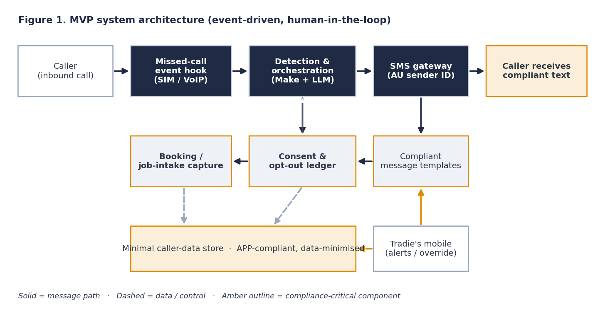
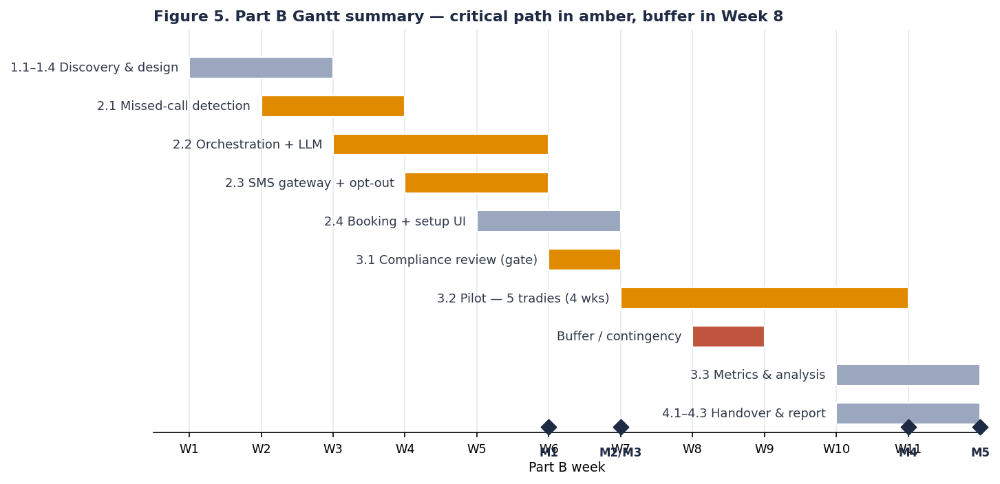

# Missed-Call Recovery Agent — Tagline: *turn missed calls into booked jobs, compliantly, in five minutes*


An AI-assisted SMS text-back and follow-up agent for **Australian sole-trader trades businesses**. When a genuine inbound call is missed, the agent replies within 60 seconds with a compliant text (business name + ABN + one-tap opt-out), runs a short follow-up, and captures the enquiry as a booking — set up from a phone in under five minutes.

> **PROF909 Professional Capstone** · Shreekrishna Gyawali (SHEA25124) · This repository is the living artefact and Part B foundation.

---

## The problem

Australia has ~1.7 million sole traders, and 97.3% of actively trading businesses are small (ABS 2025; ASBFEO 2025). Many are tradespeople who **can't answer the phone while on the tools** — and most callers who hit voicemail never ring back; they call the next business. **A missed call is a lost job**, and existing recovery tools are priced for multi-staff firms with no native Australian spam/privacy compliance.

## The evidence

- **Speed wins.** Responding within an hour makes a qualifying conversation ~7× (and ~60× vs a day) more likely (Oldroyd, McElheran & Elkington 2011).
- **Narrow automation works.** Scoped automation with graceful human escalation improves service; poor intent-handling destroys trust (Ranieri et al. 2024; Marcineková et al. 2025).
- **Adoption is about effort and trust, not cost** — the binding barrier for micro-firms (Chouki et al. 2020; Ayinaddis 2025).

## The solution

**One-line value proposition:** recover missed-call enquiries as booked work, within Australian Spam Act / Privacy law, on a solo budget.



- **Compliance-first** — name + ABN + one-tap STOP on every message; conservative inbound-only trigger; opt-outs honoured automatically.
- **Five-minute phone setup** — sensible defaults, no configuration project.
- **Australian-trades-aware** — job-intake and compliance built for AU sole traders, not a US-generic add-on.

## Tech stack

- **Orchestration:** Make (low-code) + LLM step (message composition / light intent)
- **Messaging:** Australian SMS gateway (registered sender ID)
- **Data:** minimal, APP-compliant store (see [`artefacts/data-schema.md`](artefacts/data-schema.md))
- **Docs/diagrams:** Python + matplotlib

## Setup

> Part B build. Part A ships the design artefacts below; no runtime is deployed yet.

```bash
git clone https://github.com/<your-username>/missed-call-recovery-agent.git
cd missed-call-recovery-agent
# Part B: configure gateway + Make scenario from /docs/methodology.md
```

## Project roadmap

See the [project board](docs/project-board.md) and Gantt below. Key Part B milestones: **M1** text-back working (W6) · **M2** compliance sign-off (W7) · **M3** pilot live (W7) · **M4** evaluation (W11) · **M5** handover (W12).



## Ethics, privacy and responsible AI

Governed by the **ACS Code of Professional Conduct**, **Australia's AI Ethics Principles**, the **Australian Privacy Principles**, the **Spam Act 2003 (Cth)** and the **NIST AI RMF**, with **ACSC Essential Eight** for baseline security. Every message is transparent (business ID), fair (only genuine inbound callers — never a bought list) and contestable (one-tap opt-out). See [`docs/methodology.md`](docs/methodology.md) and the model/prompt card in [`artefacts/`](artefacts/).

## Sustainability

Event-based messaging (compute only when a real call is missed) keeps the footprint small (Green IT); the tool advances **economic resilience** for micro-businesses and **equity** for operators least equipped to adopt enterprise software. Setup UI targets **WCAG 2.2 AA**.

## Documents

- [Proposal (PDF)](docs/Proposal_A3.pdf)
- [Project charter](docs/charter.md)
- [Risk register](docs/risk-register.md)
- [RACI matrix](docs/raci.md)
- [Methodology](docs/methodology.md)
- [Architecture & design](docs/architecture.md)

## Contact

Shreekrishna Gyawali · SHEA25124 ·  *email: <gyawalishreekrishna9@gmail.com>*


## Acknowledgements

PROF909 facilitator and (prospective) industry mentor. **AI Use:** AI tools assisted with structuring, critique and reference formatting only; all analysis and design reasoning are the author's own (full statement in the proposal, Appendix E).
