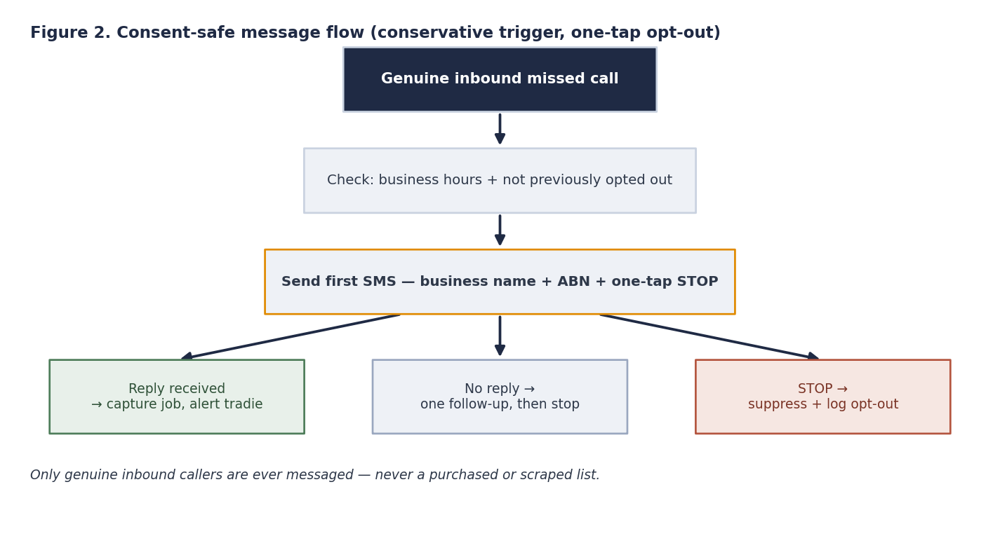

# Architecture & design

## System architecture

Event-driven, human-in-the-loop. The message path runs left to right; compliance-critical components are outlined in amber.

A missed-call event (SIM-based or VoIP hook on the tradie's existing number) triggers a **detection & orchestration** layer (Make + an LLM step for message composition and light intent handling). Before anything sends, the orchestrator checks the **consent & opt-out ledger** and business-hours rules, then sends via an **Australian SMS gateway** with a registered sender ID. Replies are captured as a **job intake**; the tradie is alerted and can override at any point.

## Consent-safe message flow

Only **genuine inbound missed callers** are ever messaged — never a purchased or scraped list. The first message carries business name + ABN + a one-tap `STOP`; `STOP` is honoured automatically and logged.

See [`../artefacts/consent-state-model.md`](../artefacts/consent-state-model.md) for the state machine and [`../artefacts/data-schema.md`](../artefacts/data-schema.md) for the minimal data model.

## Design principles → evidence

| Design choice | Evidence |
|---|---|
| 60-second response | Speed-to-lead (Oldroyd et al. 2011) |
| Narrow scope + human escalation | Scoped automation succeeds (Ranieri et al. 2024; Marcineková et al. 2025) |
| Five-minute setup, defaults | Effort/trust is the adoption barrier (Chouki et al. 2020) |
| Native ID + opt-out + data minimisation | Spam Act / APP (ACMA 2024; OAIC 2024) |
