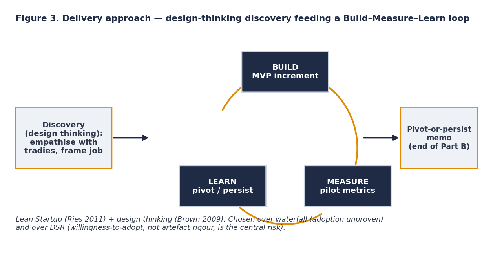

# Methodology & delivery approach

**Approach:** Lean Startup build–measure–learn (Ries 2011) + design-thinking discovery (Brown 2009), with a light Scrum cadence (Schwaber & Sutherland 2020) adapted for solo delivery.

## Why Lean (justified, not assumed)

The central risk is **behavioural, not technical** — texting a missed caller is commoditised; the open questions are whether a sole trader will *adopt and trust* the tool and whether recovered enquiries *convert*.

- **Lean over waterfall:** building a full product before testing adoption would lock in unvalidated assumptions about the very thing most in doubt. The build-measure-learn loop tests them with a real pilot at the earliest defensible point.
- **Lean over Design Science Research (Hevner 2007):** DSR centres on rigorous evaluation of an artefact against internal design objectives; here the decisive question is market-facing (adopt / convert), not specification conformance. DSR's *rigour cycle* still informs the build — the evidence base and compliance checklist are the knowledge grounding.

## How it runs

| Phase | Part B weeks | Output |
|---|---|---|
| Discovery (design thinking) | W1 | Tradie journey + consent map; message/intake templates |
| Build (increments) | W2–W6 | Detection → orchestration+LLM → gateway+opt-out → booking+setup UI |
| Measure (pilot) | W7–W11 | 5-tradie, 4-week pilot; service metrics + short qualitative feedback |
| Learn | W12 | Pivot-or-persist memo; evaluation report; handover |

## Evaluation design

Simple **mixed methods** (Creswell & Creswell 2023): quantitative service metrics (≥40% texted back <60s; ≥15% respond/book; median setup <5 min) alongside short qualitative feedback on trust, effort and reputation. Numbers show whether the mechanism works; feedback explains the adoption behaviour behind them.
